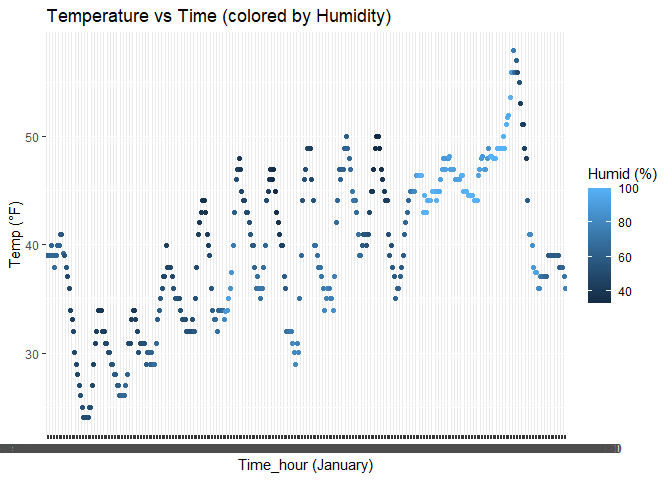

p8105_hw1_th3147
================
2025-09-17

# Problem 1

``` r
library(moderndive)

data("early_january_weather")
```

1.  Variables

    \*origin (chr): Airport code (all “EWR”).

    \*year, month, day, hour (int): Time of recording.

    \*temp (num): Temperature in degrees Fahrenheit.

    \*dewp (num): Dew point in degrees Fahrenheit.

    \*humid (num): Relative humidity in %.

    \*wind_dir (num): Wind direction in degrees.

    \*wind_speed (num): Wind speed (mph).

    \*wind_gust (num): Wind gust speed (mph).

    \*precip (num): Precipitation in inches.

    \*pressure (num): Sea level pressure in millibars.

    \*visib (num): Visibility in miles.

    \*time_hour (POSIXct): Date and hour of the recording.

2.  358 nrow and 15 ncol.

3.  The mean is 39.5821229.

4.  Scatter plot of temp (y) vs time_hour (x)

``` r
library(ggplot2)

early_january_weather$time_hour <- gsub("一月", "1", early_january_weather$time_hour)

ggplot(early_january_weather, aes(x = time_hour, y = temp, color = humid)) +
  geom_point() +
  labs(
    x = "Time (hourly, January 2013)",
    y = "Temperature (°F)",
    color = "Humidity (%)",
    title = "Temperature vs Time (colored by Humidity)"
  )
```

<!-- -->

``` r
ggsave("scatter_plot.pdf", height = 4, width = 6)
```

    *Describe patterns:

    1. Temperature increases over time

    2. As time progresses and the temperature generally rises, the humidity levels also tend to increase.

    3. The data indicates that temperatures rise and fall throughout each 24-hour cycle.

# Problem 2

1.  Create a table

``` r
library(tidyverse)

my_table <- tibble(
  
  NormalSample = rnorm(10),
  
  greaterzero = rnorm(10) > 0,
  
  Charavec = c("mango", "lemon", "cherry", "date", "fig", "grape", "kiwi", "apple", "strawberry", "nectarine"),
  
  Factorvec = factor(rep(c("step1", "step2", "step3"), length.out = 10),
                        levels = c("step1", "step2", "step3"))
)

my_table
```

    ## # A tibble: 10 × 4
    ##    NormalSample greaterzero Charavec   Factorvec
    ##           <dbl> <lgl>       <chr>      <fct>    
    ##  1       0.0173 TRUE        mango      step1    
    ##  2       0.464  FALSE       lemon      step2    
    ##  3      -2.14   FALSE       cherry     step3    
    ##  4       0.613  TRUE        date       step1    
    ##  5       1.21   TRUE        fig        step2    
    ##  6      -1.27   TRUE        grape      step3    
    ##  7       1.07   TRUE        kiwi       step1    
    ##  8      -0.948  FALSE       apple      step2    
    ##  9       0.456  TRUE        strawberry step3    
    ## 10      -0.303  FALSE       nectarine  step1

2.  Show the mean value

``` r
mean(pull(my_table, NormalSample))
```

    ## [1] -0.08360107

``` r
mean(pull(my_table, greaterzero))
```

    ## [1] 0.6

``` r
mean(pull(my_table, Charavec))
```

    ## Warning in mean.default(pull(my_table, Charavec)): argument is not numeric or
    ## logical: returning NA

    ## [1] NA

``` r
mean(pull(my_table, Factorvec))
```

    ## Warning in mean.default(pull(my_table, Factorvec)): argument is not numeric or
    ## logical: returning NA

    ## [1] NA

      *NormalSample will work because this variable is a numeric vector.

      *greaterzero will work because R treats TRUE and FALSE as 1 and 0.

      *Charavec will not work because it is a character vector.

      *Factorvec will not work because it is a factor vector.

3.  Convert the variable

``` r
as.numeric(pull(my_table, greaterzero))
```

    ##  [1] 1 0 0 1 1 1 1 0 1 0

``` r
as.numeric(pull(my_table, Charavec))
```

    ## Warning: NAs introduced by coercion

    ##  [1] NA NA NA NA NA NA NA NA NA NA

``` r
as.numeric(pull(my_table, Factorvec))
```

    ##  [1] 1 2 3 1 2 3 1 2 3 1

      *Regarding greaterzero, When you convert the logical vector to numeric, it works perfectly. TRUE values are converted to 1 and FALSE values are converted to 0. 

      *Regarding Charavec, it fails to convert since our character vector contains words and not numerical characters.

      *Regarding Factorvec, When you convert the factor vector to numeric, R will give a number for each level. For example, since "step1" is the first level, it will be converted to 1, "step2" to 2, and "step3" to 3.

4.  Does this help explain what happens when you try to take the mean?

    \*Yes. it explains why the Charavec and Factorvec cannot calculate
    the mean value. The reason is that the character vector couldn’t be
    converted to numbers. For the factor vector (Factorvec), the
    conversion to numbers worked, but it returned the internal level
    codes (1, 2, 3), not a meaningful numerical representation of the
    data.
